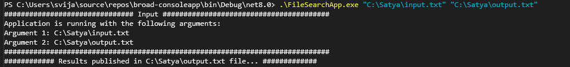
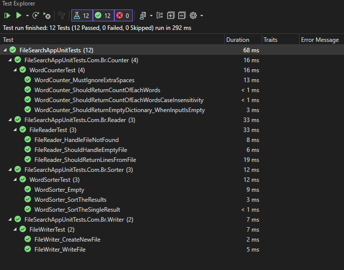

# File Search Word Count App
Console application to find number of its occurrences in the source file

## Build from source

## Project Keypoints
#### Performance, reasonable economy of CPU and Memory resources
- Used efficient Data Structures like Dictionary<TKey, TValue>, List<T> for better memory and performance
- async/await is implemented for IO-bound tasks, making the best use of CPU

####  Scalability on multicore/multiprocessor systems
- Used Task for better workload

#### Expect incorrect input from the user
- User Friendly Messages are provided
- Input validation is provided for file format and incorrect input

#### Have a modular decomposition and contain unit tests
- Structure the application into clear modules (classes, namespaces) following SOLID principles
- Dependency Injection (DI) using frameworks like Microsoft.Extensions.DependencyInjection to allow easy swapping of modules

#### Have a convenient architecture for further expansion of functionality
- Ensure classes are open for extension but closed for modification by using interfaces and abstract classes

#### Have a description of the architecture in any convenient form
- FileAnalyzer process the entire flow by making use of FileReader, FileWriter, WordCounter and WordSorter
- FileReader is responsible to read the input file with Windows-1252 encoding
- FileWriter is responsible to write the output result file
- WordCounter is responsible to take the each input line in async manner to preserve the result back
- WordSorter is responsible to sort the result at the end

## Test Results
